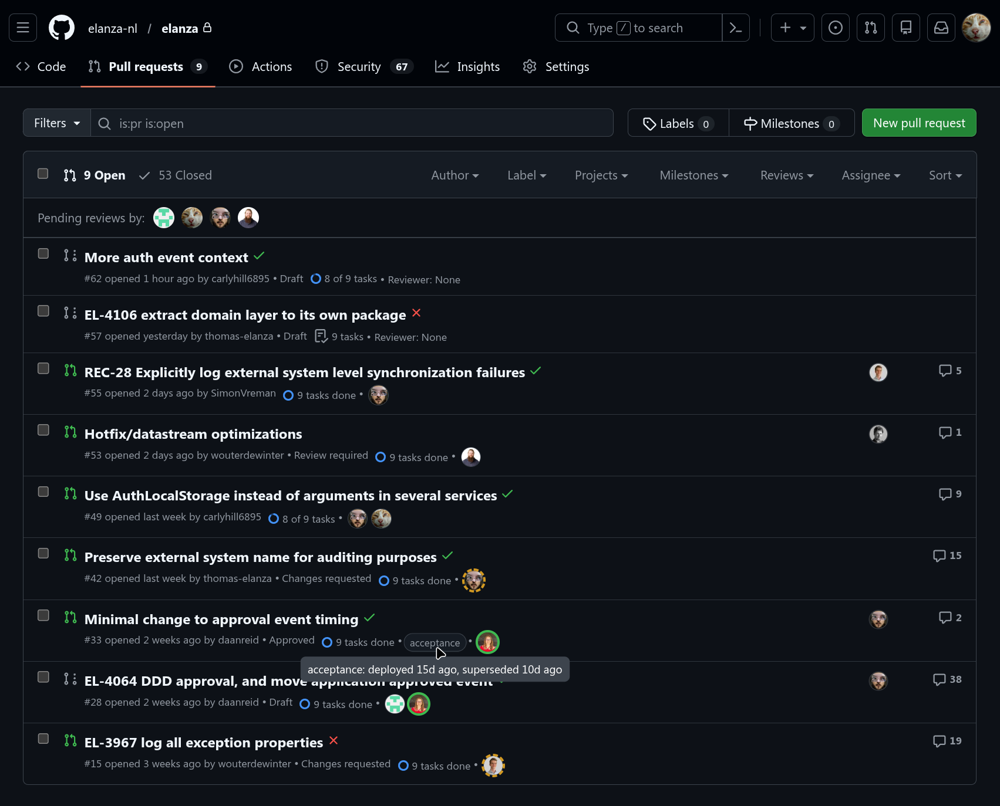
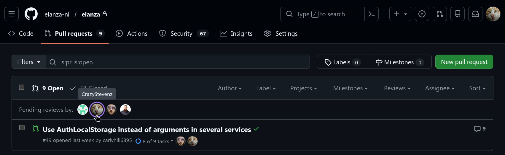

# GitHub PR Enchancer

A Firefox extension that displays reviewers directly in the GitHub Pull Request list view.

## Features

- Reviewer filter bar
    - Shows all reviewers on the current page who haven't requested changes on, or approved a, PR
    - Clicking on an avatar will filter the current page to only show work pending for that person
- Reviewer avatars on individual PRs
    - Shows status of review (pending, requested changes, approved)
        - Green full circle border: Reviewer has approved PR
        - Yellow dashed circle border: Reviewer has requested changes on PR
        - No border: Reviewer hasn't looked at PR, or has only commented
    - Displays "None" when no reviewers are assigned
    - Supports "Team" reviewers
- Unresolved conversations badge
    - Shows the number of unresolved review threads (inline comment conversations) on a PR
        - Red with a count: the PR still has unresolved conversations
        - Green check: every conversation has been resolved
        - No badge: the PR has no review threads
    - Hovering over the badge lists each thread with its file, author, and resolved / outdated state
    - Requires a token (GitHub only exposes thread resolution through the GraphQL API)
- Merge conflicts tag
    - Red "Conflicts" tag when the PR branch cannot be merged into its base without conflicts
    - Nothing is shown when the PR is mergeable
    - GitHub computes mergeability lazily; the extension retries a couple of times when the state is not known yet
- Deployment status pills
    - List the environments a PR has been or is currently deployed to
        - Green: The PR is currently deployed to this environment
        - Yellow pulsing: The PR is being deployed to this environment
        - Gray: The PR was deployed to this environment at some point, but has been superseded by a different branch
    - Hovering over a pill will show additional info depending on context, e.g. deployment at, superseded on, etc

## Installation

**For Developers:**
1. Package the extension: `web-ext --config=web-ext.config.mjs build --overwrite-dest` (from extension directory)
2. upload to addons.mozilla.org

**For users:**
Download the latest .xpi from releases. 

## Configuration

For private repositories or to increase API rate limits, you need to configure your GitHub Personal Access Token.

1. Open Firefox and navigate to `about:addons`
2. Find "GitHub PR Enhancer" and click on it
3. Click the "Options" or "Preferences" tab
4. The GitHub PR Enhancer Settings page will open as shown below

5. Click "Create a token here" link
6. GitHub's fine-grained token creation page will open
7. Give the token a name, select the repositories it will be used on, and under Permissions set `Pull requests` to `Read`
8. Generate the token and copy it
9. Paste the token in the input field and click "Save".
